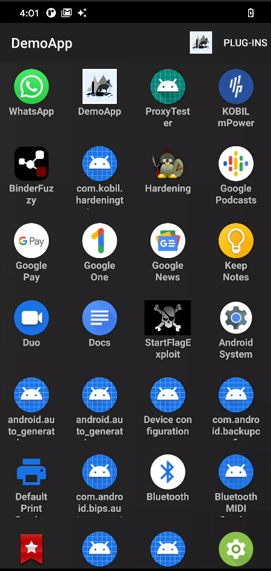

# Gleipnir - Attack POC


# Table of Contents
* [Description](#description)
* [Paper](#paper)
* [Usage](#usage)
    * [App usage](#app-usage)
    * [Python usage](#python-usage)
    * [Verbose mode](#verbose-mode)
    * [Library integration](#library-integration)
    * [Other apps](#other-apps)
* [Build](#build)
* [Test](#test)
* [Create Plug-Ins](#create-plug-ins)
* [Enable frida-plugin](#enable-frida-plugin)
* [Other projects](#other-projects)

## <a name="description"/> Description

Gleipnir introduces a new Attack which is able to execute third party Apps dynamically at Runtime. Instead of extract the victim App, modify it and deploy with a different signing key, this threat loads the full unmodified victim App in a compromised process owned by the attacker. This offers the chance to apply reflection or hooking actions without the need having root access.
Real users could install such an App tainted as classical Launcher App for example and the full potential of this threat could be applied. Obtain user's personal information, credentials, manipulate transactions or Advertising identifiers to let the Attacker earn the clicks produced by the user playing Games or familiar Apps are some of the goals possible to reach.
This work figures out the possibility how to perform this attack conceptional as well as experimental.

The Gleipnir threat brings most benefits of the repackaging Attack, no root needed for example, and extends it by the following benefits:
* *Dynamically* -  The victim App(s) must not be known to the attacker before and will be compromised at runtime
* *Apk digest* -  The original App is not touched means the Apk digest of the Apk doesn't change.
* *Distribution* - No need for having a installation per App. Just one malicious App including the Gleipnir code is able to attack App's installed on the users Device. Best way to do this would be a Launcher App (a home screen replacement).

But some disadvantages have to be mentioned:
* *Runtime only* - The Gleipnir Attack is a Runtime only attack and thus depends on the Android implementation. New Android versions may require migration.
* *No code changes - Potentially it's not possible to just modify code of the victim App. Hooking or Reflection can be used to manipulate the behaviour.

## <a name="paper"/> Download paper

Download [here](doc/Gleipnir.pdf)

##  <a name="usage"/>  Usage

Gleipnir attack can be used via different ways:

* Android Library
* "Demo" App
* Python cli


### <a name="app-usage"/>  App usage

1) First download the demo apk here:

2) Start Gleipnir "Demo App"

3) Select plugins to be enabled (optional)

=> If you enable the frida plugin please have a look at the [Enable frida-plugin](#enable-frida-plugin) chapter. If enabled Gleipnir will wait for frida to be connected after clicking on the target App icon.

4) Select App to be started via Gleipnir



(Now you can have a second instance of the App as well as you can connect frida and debugger, ...)


### <a name="python-usage"/> A Python cli

[...] (WIP)

### <a name="library-integration"/> Library integration

You can easily integrate gleipnir into you're project.


Just include the maven repository

1) In your root build.gradle:
```groovy
allprojects {
        repositories {
            [..]
            jcenter()
            maven { url "https://jitpack.io" }
        }
   }
```
2) In your library/build.gradle add:
```groovy
   dependencies {
        implementation 'com.github.ChickenHook:Gleipnir:1.0'
   }
```


### <a name="other-apps"/>  Other Apps

Gleipnir - VM (WIP)


## <a name="build"/> Build


### Build Requirements
Android Studio: 3.6.1

Android Versions: 26 - 30 (preview 3)

#### Gradle
```
gradle :gleipnir:assemble
```
#### Android Studio

Launch gleipnir Run Configuration

## <a name="test"/>  Test

Along with this project the sumbodul testVictim is provided.
This App can be used to test the gleipnir attack.

1. Build the gleipnir module
2. Install the gleipnir apk
3. Build the testVictim module
4. Install the testVictim apk
5. Launch the Gleipnir App
6. Select the Test Victim App

## <a name="create-plug-ins"/>  Create Plug-Ins

The Interface IPlugin.kt can be implemented in order to create
extensions for the Gleipnir App.

First create a Kotlin class in package:
```
org.gleipnir.app.plugins
```
and implement the IPlugin interface.

Next and last step is to register the Plug-In in the list of Plug-Ins
located in the Plugtivity class. Just add the Plug-In constructor to
 the field:
```
pluginsList
```

## <a name="enable-frida-plugin"/>  Enable the frida Plug-In (OPTIONAL)

In order to enable the frida Plug-In you have to insert frida gadget
libraries into the
```
gleipnir/src/main/jniLibs/[arch]/libfrida-gadget.so
```
folder(s). You can rename this file just have a look at FridaPlugin.kt

## <a name="other-projects"/> Other Projects

| Project | Description |
|---------|-------------|
| [ChickenHook](https://github.com/ChickenHook/ChickenHook) | A linux / android / MacOS hooking framework  |
| [BinderHook](https://github.com/ChickenHook/BinderHook) | Library intended to hook Binder interface and manipulate events |
| [RestrictionBypass](https://github.com/ChickenHook/RestrictionBypass) |  Android API restriction bypass for all Android Versions |
| [AndroidManifestBypass](https://github.com/ChickenHook/AndroidManifestBypass) |  Android API restriction bypass for all Android Versions |
| .. | |

## Sponsor

If you're happy with my library please order me a cup of coffee ;) Thanks.